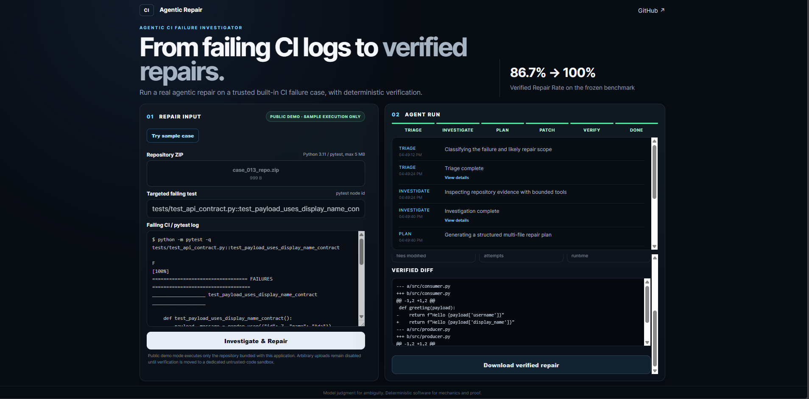

# Agentic CI Failure Investigator & Verified Repair System

An agentic system for diagnosing failed Python CI runs, identifying the real repair scope, generating coordinated code changes, and proving those repairs with deterministic verification.

> **Frozen final result:** baseline mean Verified Repair Rate (VRR) **86.7%** vs advanced system **100.0%** on the same 20-case synthetic benchmark across three repeated runs (**+13.3 percentage points**). Evaluated from `v1.0.0-hackathon` at commit `01231fd92db105b1fe8be18a4e4340fcd3dc5b5a`.

---

## Live web application

The project is deployed as a real end-to-end application, not a static project page.

**Live application:** https://ci-repair-agent.vercel.app

The public demo runs a trusted built-in CI failure case through the real repair pipeline:

1. load the failing repository and pytest log;
2. classify the failure with the triage agent;
3. investigate repository evidence with bounded tools;
4. generate a structured multi-file repair plan;
5. apply the repair transactionally;
6. run syntax, targeted-test, and full-suite verification;
7. return `VERIFIED_REPAIR` only if every deterministic gate passes;
8. expose the verified diff and a downloadable repaired repository.



### Download verified repair

After a repair reaches `VERIFIED_REPAIR`, the application provides **Download verified repair**.

The downloaded ZIP is the repaired repository produced from the verified working copy—not just a text report or patch snippet. It contains the repository files with the accepted edits already applied.

For the built-in multi-file API-contract example, the repaired archive contains the corrected producer and consumer code together with the test suite. The original repository remains untouched; the repair is applied to an isolated working copy and only the verified result is packaged for download.

In practical terms:

```text
broken repository
      +
failing CI / pytest log
      |
      v
agent investigation
      |
      v
transactional repair
      |
      v
syntax + targeted test + full regression suite
      |
      v
VERIFIED_REPAIR
      |
      v
download repaired repository.zip
```

---

## Problem & user value

### Who has this problem?

Software engineers maintaining Python repositories with failing CI pipelines.

### What is the bottleneck?

A CI failure often leaves the engineer with fragmented evidence:

- a failing pytest log;
- repository code spread across multiple files;
- configuration and contract dependencies;
- a targeted failure that may hide a broader regression;
- uncertainty about whether a proposed patch truly fixed the system.

The expensive part is not typing a patch. It is **finding the root cause, changing the correct scope, and proving that the repair did not introduce another failure**.

### What does the system produce?

The workflow accepts:

```text
repository + failing CI/test log + optional repository context
```

and returns one of:

```text
VERIFIED_REPAIR
NO_CODE_PATCH_REQUIRED
UNRESOLVED
```

A code repair counts as verified only when:

1. the patch applies safely;
2. Python syntax validation passes;
3. the targeted failing test passes;
4. the full regression suite passes.

---

## Primary metric

The primary metric is **Verified Repair Rate (VRR)**:

```text
verified repairable cases / total repairable cases
```

A repair is not counted merely because an LLM claims it is correct. Success is assigned by deterministic verification.

---

## Frozen final evaluation

| Metric | Simple baseline | Advanced system |
|---|---:|---:|
| Benchmark cases | 20 | 20 |
| Repeated runs | 3 | 3 |
| Verified Repair Rate | **86.7% mean** | **100.0% mean** |
| VRR range | 80.0%-90.0% | 100.0%-100.0% |
| VRR population stddev | 4.71 pp | 0.00 pp |
| Approx. API cost | $0.007766 mean/run | $0.044514 mean/run |
| Absolute improvement | - | **+13.3 pp** |

The baseline and advanced system use the same 20 benchmark cases and were each rerun three times from the frozen source tag `v1.0.0-hackathon` (`01231fd92db105b1fe8be18a4e4340fcd3dc5b5a`). Cost figures are evaluator estimates rather than billing statements.

Canonical frozen artifacts:

```text
results/frozen_final/FROZEN_SUMMARY.md
results/frozen_final/frozen_summary.json
```

## Current measured development result

### Development evidence retained for auditability

Before the final freeze, the repeated development baseline averaged **88.3% VRR** and the advanced development run achieved **100.0%**, a **+11.7 pp** development delta. Those values remain in the changelog as development history and are **not** the final submission headline.

---

## Why agents?

The system deliberately separates tasks that benefit from model judgment from tasks that require deterministic mechanics.

### Agent responsibilities

**Triage agent**
- classifies the failure;
- identifies evidence and likely target files;
- routes the next step.

**Investigation agent**
- uses bounded repository tools;
- searches code, symbols, tests, and configuration;
- identifies root cause and repair scope.

**Patch agent**
- proposes minimal exact Search-and-Replace edits;
- can express coherent multi-file repairs.

**Retry agent**
- receives deterministic verification feedback after a failed attempt;
- proposes a new complete repair plan;
- runs within a maximum three-attempt loop.

### Deterministic responsibilities

Code—not the LLM—handles:

- exact patch application;
- transactionality across multiple edits;
- syntax checking;
- targeted pytest verification;
- full regression verification;
- repository-state hashing;
- patch hashing;
- duplicate-state detection;
- no-progress detection;
- A → B → A oscillation detection;
- final status assignment.

> **Design principle:** agents handle judgment; deterministic software handles mechanics and proof.

---

## Architecture

```text
Failing CI case
      |
      v
+-------------+
| Triage      |
| Agent       |
+-------------+
      |
      v
+--------------+      bounded repository tools
| Investigation| <-----------------------------+
| Agent        |                               |
+--------------+                               |
      |                                        |
      v                                        |
+-------------+                                |
| Patch Agent |                                |
+-------------+                                |
      |                                        |
      v                                        |
Transactional exact Search/Replace             |
      |                                        |
      v                                        |
+-------------------------------+              |
| Deterministic Verification    |              |
| 1. syntax                     |              |
| 2. targeted test              |              |
| 3. full regression suite      |              |
+-------------------------------+              |
      |                                        |
 success | failure                              |
      |      \                                  |
      v       \ verification feedback          |
 VERIFIED     +--> Retry Agent ----------------+
 REPAIR
```

The retry loop is capped at three attempts and guarded by state, patch, and failure-signature circuit breakers.

---

## Web deployment architecture

The production demo separates the UI from the repair service:

```text
Browser
  |
  v
Vercel — Next.js frontend
  |
  | HTTPS API
  v
Render — FastAPI backend
  |
  +--> triage / investigation / patch / retry agents
  |
  +--> deterministic verification
  |
  +--> repaired ZIP artifact
```

The public deployment currently runs **trusted built-in sample execution only**. Arbitrary uploaded repositories remain disabled until verification can be moved to a dedicated untrusted-code sandbox.

This keeps the public demo genuinely executable while preventing arbitrary third-party Python code from running inside the API service that holds backend secrets.

---

## Benchmark

The benchmark contains **20 deliberately broken synthetic Python repositories** covering:

- local logic defects;
- boundary and `None` handling;
- configuration fallback issues;
- mapping errors;
- state mutation bugs;
- boolean parsing;
- semantic-version comparison;
- cache-key defects;
- retry semantics;
- regression-sensitive parsing;
- path handling;
- configuration precedence;
- multi-file API contract changes;
- case-insensitive lookup;
- unit migration across files;
- stale-cache behavior;
- path-containment bugs;
- ordering and deduplication defects;
- timestamp contract issues;
- configuration and validation drift.

Benchmark ground truth is evaluator-only and is not exposed to the repair agents.

---

## Important failure modes and engineering lessons

### 1. Single-file repair was not enough

Cross-file contract cases exposed the main limitation of the simple baseline. The decisive improvement was **multi-file transactional patch planning**.

### 2. A targeted test passing is not proof

A repair can satisfy the originally failing test and still break another test. The final gate therefore always runs the full suite.

### 3. More preprocessing was not automatically better

Log preprocessing was tested as an improvement, but repeated evaluation showed **0.0 percentage-point improvement** over the baseline. The negative result is retained in the project history rather than presented as a success.

### 4. LLM output needs deterministic boundaries

Structured schemas, exact edits, state hashes, retry limits, and circuit breakers convert model proposals into a bounded engineering workflow.

## Hot take

> **Key insight:** the strongest reliability improvement did not come from adding more prompting. It came from separating judgment from proof.

---

## Quick start

### Requirements

- Python **3.11**
- Git
- OpenAI API key only for model-backed runs

### Install

```powershell
git clone https://github.com/akshat240401/ci-repair-agent.git
cd ci-repair-agent

py -3.11 -m venv .venv
.\.venv\Scripts\Activate.ps1

python -m pip install --upgrade pip
pip install -e .
pip install -r requirements-dev.txt
```

### Deterministic evaluation

```powershell
python .\evaluate.py
```

### API-backed smoke case

```powershell
$env:OPENAI_API_KEY="YOUR_KEY"
$env:MODEL_NAME="gpt-5.6-luna"
$env:MODEL_REASONING_EFFORT="low"

python .\evaluate.py --mode smoke --case case_010
```

### Full advanced benchmark

```powershell
python .\evaluate.py --mode full
```

For exact baseline reproduction, clean-room setup, expected outputs, and final freeze rules, see [`REPRODUCTION.md`](REPRODUCTION.md).

---

## Run the web application locally

The web application uses a Next.js frontend and FastAPI backend.

### Backend

```powershell
cd "C:\path\to\ci-repair-agent"
.\.venv\Scripts\Activate.ps1

pip install -r .\web_backend\requirements.txt

$env:OPENAI_API_KEY="YOUR_KEY"
$env:MODEL_NAME="gpt-5.6-luna"
$env:MODEL_REASONING_EFFORT="low"
$env:WEB_ORIGINS="http://localhost:3000"
$env:PUBLIC_DEMO_ONLY="false"

uvicorn web_backend.app:app --reload --host 127.0.0.1 --port 8000
```

Backend health:

```text
http://127.0.0.1:8000/health
```

### Frontend

```powershell
cd .\web
npm install
```

Create `web/.env.local`:

```text
NEXT_PUBLIC_API_URL=http://127.0.0.1:8000
NEXT_PUBLIC_DEMO_ONLY=false
```

Then:

```powershell
npm run dev
```

Frontend:

```text
http://localhost:3000
```

---

## Improvement changelog

The complete experiment history is in [`IMPROVEMENT_CHANGELOG.md`](IMPROVEMENT_CHANGELOG.md).

It covers:

- the simple baseline;
- log preprocessing and why it was rejected as a primary improvement;
- triage;
- bounded investigation;
- multi-file transactional patching;
- deterministic verification;
- retry and circuit-breaker hardening.

---

## Agent trajectories

Representative trace artifacts are stored under `trajectories/`.

They include:

- simple repair;
- multi-file repair;
- regression-sensitive repair;
- configuration-contract repair;
- deterministic retry-recovery proof;
- deterministic circuit-breaker proof;
- deterministic `NO_CODE_PATCH_REQUIRED` policy proof.

Live benchmark trajectories and deterministic proof artifacts are explicitly labeled separately.

---

## Repository structure

```text
baseline/                 simple one-shot comparison agent
benchmark/                20 synthetic CI failure cases + evaluator-only ground truth
evaluation/               baseline/final runners, metrics, reports, experiments
results/                  measured experiment artifacts
scripts/                  setup/reproduction utilities

src/
  agents/                 triage, investigation, patch, retry agents
  orchestration/          no-code policy/result handling
  patching/               exact and transactional patch application
  schemas/                structured model outputs
  state/                  hashing and circuit-breaker logic
  tools/                  bounded repository investigation tools
  verification/           syntax/targeted/full-suite verification

tests/                    deterministic tests
trajectories/             representative agent/proof artifacts

web/                      Next.js frontend
web_backend/              FastAPI web adapter and deployment container

evaluate.py               one-command evaluation entry point
IMPROVEMENT_CHANGELOG.md  measured development history
REPRODUCTION.md           clean-room reproduction instructions
WEB_APP_README.md         web-app deployment and local-run notes
```

---

## Safety and scope

- Current repair benchmark scope is Python 3.11 / pytest repositories.
- Repairs are applied to temporary working copies.
- Benchmark ground truth is evaluator-only.
- Credentials are supplied through environment variables and must never be committed.
- The system does not directly push repaired code to production repositories.
- The production public demo executes only the trusted built-in sample repository.
- Arbitrary public repository execution remains disabled until a dedicated untrusted-code sandbox is connected.
- `NO_CODE_PATCH_REQUIRED` is intentionally narrow and used only when triage identifies an environment/configuration problem with no repository target files.

---

## Reproducibility status

A separate clean checkout and clean Python 3.11 virtual environment has successfully reproduced:

- the deterministic test suite;
- 20/20 benchmark failure reproduction;
- evidence generation;
- fair baseline cost reporting;
- trajectory export;
- an API-backed verified-repair smoke case.

The final benchmark was rerun from frozen source tag `v1.0.0-hackathon` at commit:

```text
01231fd92db105b1fe8be18a4e4340fcd3dc5b5a
```

The six repeated-run artifacts are preserved under:

```text
results/frozen_final/
```

---

## Release

Final submission release:

https://github.com/akshat240401/ci-repair-agent/releases/tag/v1.0.0-submission

Frozen evaluation source:

```text
v1.0.0-hackathon
01231fd92db105b1fe8be18a4e4340fcd3dc5b5a
```
